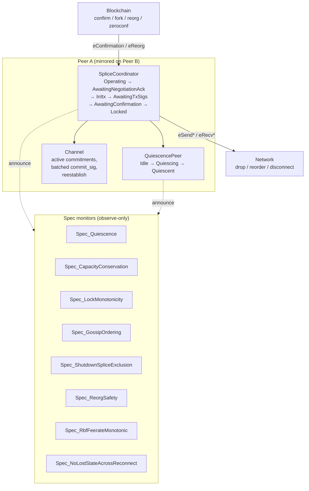

# Agentic Formal Methods for the Lightning Network

> Source deck for LaTeX conversion. One `## Slide N: Title` per slide.
> All BOLT citations are `file:line` verified against this repo. All P
> fragments are copied (trimmed) from `models/src/*.p`.

---

## Slide 1: Prose Specs Hide Ambiguity. Agents Expose It.

**Thesis.** The BOLTs are English MUST/SHOULD/MAY prose. Prose is the worst
possible medium for a consensus-critical, adversarial, asynchronous protocol:
every "SHOULD" is an interop fork, every unstated race is a funds-loss vector.

- The spec text is normative; the state machine it implies is *latent*.
- Translating that latent machine into an executable model forces every
  implicit assumption into the open.
- An LLM agent can do this translation across the *whole* corpus, run a model
  checker, triage counterexamples, and round-trip each one back to a `file:line`
  citation — sustained coverage a human spec team rarely sustains.

**Artifact.** A real P model of channel splicing now lives in `models/`:
8 build phases, 17 P tests + 3 Go bridge tests green, 20 catalogued questions,
10 findings against the live spec text.

*Notes: This is not a proposal. The model in `models/` already exists and is
the evidence for everything that follows. The pitch is to make this loop
standard practice for every spec change.*

---

## Slide 2: Why Splicing Is the Hard Case

Lightning is money software with no rollback. Splicing is the subtlest
sub-protocol in the BOLTs because five independent state machines interleave
on the *live* funding output:

- **Quiescence** (`stfu`) — `02-peer-protocol.md:1490`. Must pause the channel
  before any structural change.
- **Interactive-tx** — `02-peer-protocol.md:100`. Turn-based, RBF-able tx
  construction, shared with v2 dual-funding.
- **Splice glue** — `02-peer-protocol.md:1558`. Drives the above, tracks
  multiple in-flight commitments.
- **Reconnect** (`channel_reestablish`) — `02-peer-protocol.md:3360`. Retransmit
  semantics for half-signed splices.
- **Blockchain** — confirmation, RBF fee bumps, reorg, zeroconf.

The cartesian product of these — quiescence × interactive-tx × RBF × reconnect ×
reorg — is where the ambiguity lives. No worked example in `splicing-test.md`
covers the whole space; a checker does.

*Notes: The eleven disconnect/reconnect scenarios in `splicing-test.md:313+`
are hand-authored point samples. The model generalizes them into a schedule
space and explores ~88 distinct interleavings of the deepest one.*

---

## Slide 3: What Is P?

[P](https://p-org.github.io/P/) is a state-machine language for asynchronous,
event-driven systems, from Microsoft Research and used heavily inside AWS to
verify production systems (S3, EBS, and other storage/coordination services).

- You write **machines**: actors that receive events, mutate local state, and
  `send`/`announce` events. Exactly the Lightning peer model.
- You write **spec monitors**: separate observers that watch the event stream
  and `assert` global invariants.
- The **checker** explores message interleavings exhaustively within bounds; a
  violated assertion yields a concrete, replayable counterexample schedule.

**Why it fits Lightning.** Async message passing, adversarial scheduling
(`Network` can drop/reorder/disconnect), non-deterministic environment
(`Blockchain` confirms/forks/reorgs) — these are first-class in P, not bolted on.

*Notes: P's value over pen-and-paper TLA+ here is that the model is close to
implementation shape — the same decomposition a real client uses — so the
findings transfer directly and the trace bridge (Slide 14) is mechanical.*

---

## Slide 4: Why "Agentic"

A human formalist models the section they're focused on. An agent models the
*corpus* and keeps the model honest across phases:

1. **Reads the whole spec.** Surveys every relevant clause into
   `SPEC_SURVEY.md` with `file:line` citations before writing a line of P.
2. **Seeds hypotheses.** Pre-registers 18 candidate ambiguities in
   `SPEC_QUESTIONS.md` (Q1–Q18) — each a falsifiable claim the model must
   resolve or confirm.
3. **Builds iteratively.** 8 phases; each adds machines/monitors and never
   breaks a prior phase's checks (`README.md` phase table).
4. **Runs the checker, triages counterexamples.** Maps each schedule back to a
   clause; promotes real ambiguities to `FINDINGS.md`, retires non-issues.
5. **Closes the loop.** Generates conformance traces from the model
   (`scripts/generate.sh`) so a spec change regenerates the test vectors.

*Notes: The discipline that's hard for humans is the bookkeeping — every monitor
cites a clause, every finding cites a question, every question cites a line. The
agent maintains that web of citations as the source of truth.*

---

## Slide 5: Model Architecture

Decomposition mirrors the BOLT section structure (`ARCHITECTURE.md`): one
machine per sub-protocol per peer; `Network` and `Blockchain` are global;
whole-system invariants live in dedicated monitors, not buried in machine code.



- `splicing.pproj` — protocol machines + protocol monitors.
- `infra.pproj` — `Network` + `Blockchain`, independently checkable so
  reorg/disconnect logic is exercised without the full harness.

*Notes: "Smallest change-blast-radius" — a spec PR targets one BOLT section,
which maps to one model file. That property is what makes the loop in Slide 17
viable in CI.*

---

## Slide 6: Real P — The Quiescence State Machine

From `models/src/quiescence.p`. Each handler cites the BOLT clause it enforces;
the assertion *is* the spec rule, executable.

```p
machine QuiescencePeer {
  state Idle {
    on eOpenStfu do {
      // BOLT 2 §1508–1509: MUST NOT send stfu while HTLC adds / removals /
      // fee updates are pending.
      if (hasPendingUpdates) { return; }
      // BOLT 2 §1510: MUST NOT send stfu twice.
      assert !sentStfu, "BOLT 2 sec1510: stfu sent twice from Idle on eOpenStfu";
      sentStfu = true; iSentInitiator = 1;
      announce eStfuSent, (peer = pid, initiator = 1);
      send peerRef, eRecvStfu, (channel_id = 0, initiator = 1);
      goto Quiescing;
    }
    // ...
  }

  state Quiescing {
    on eUpdateAttempted do {
      // BOLT 2 §1517: MUST NOT send an update message after stfu.
      assert false, "BOLT 2 sec1517: update sent after our stfu (Quiescing)";
    }
    on eDisconnect do {
      // BOLT 2 §1529–1530: disconnect clears quiescence.
      announce eQuiescenceCleared, (peer = pid,);
      goto Reset;
    }
  }
}
```

*Notes: `Idle → Quiescing → Quiescent → Reset`. The `initiator=1` / `initiator=0`
split is the literal `02-peer-protocol.md:1506–1517` sender rule. The
`assert false` on `eUpdateAttempted` makes "MUST NOT send update after stfu" a
checkable property, not a footnote.*

---

## Slide 7: Real P — A Spec Monitor

Monitors are observe-only; they never drive the protocol, they only watch the
announced event stream and assert global invariants. From `models/src/monitors.p`:

```p
// Spec_LockMonotonicity — once a peer has emitted eSpliceLockedComplete for
// a splice_txid, that peer MUST NOT emit any further commit_sig referencing
// a strict ancestor funding tx of that splice.
// BOLT 2 §2024–2028 ("MUST stop sending commitment_signed for RBF attempts
// and ancestors of this splice transaction" once splice_locked is mutual).
spec Spec_LockMonotonicity
observes eSpliceLockedComplete, eCommitSigEmitted
{
  var locked: map[tPeerId, tTxid];
  start state Watching {
    on eSpliceLockedComplete do (e: (peer: tPeerId, txid: tTxid, ...)) {
      locked[e.peer] = e.txid;
    }
    on eCommitSigEmitted do (e: (peer: tPeerId, funding_txid: tTxid, ...)) {
      if (e.peer in locked) {
        assert e.funding_txid >= locked[e.peer],
          "Spec_LockMonotonicity: commit_sig emitted for ancestor of locked splice";
      }
    }
  }
}
```

*Notes: This is the BOLT 2 §2024–2028 "stop signing ancestors after mutual lock"
rule as a temporal safety property. `Spec_CapacityConservation` is the analogous
arithmetic invariant: `newCapacity == oldCapacity + Σ(contributions)`,
citing §1810–1815. Each monitor is grep-able back to its clause.*

---

## Slide 8: Spec Text → Model Assertion

The receiver-side `splice_init` rule, `02-peer-protocol.md:1666–1707`:

```
The receiving node:
  - If the channel is not quiescent:                              (§1687)
    - MUST send a `warning` and close ... or send an `error` ...
  - If the sending node is not the quiescence initiator:          (§1690)
    - MUST send a `warning` ...
  - If funding_contribution_satoshis is negative and its absolute
    value is greater than the sending node's current channel       (§1704)
    balance: MUST send a `warning` ...
```

becomes, in `models/src/splice_coordinator.p`:

```p
fun handlePeerNegotiationInit(contrib: tContributionSats, feerate: int) {
  peerContribution = contrib;
  if (contrib < 0 && (0 - contrib) > peerBalance) {
    // BOLT 2 §1704: |negative contribution| MUST NOT exceed sender balance.
    assert false, "BOLT 2 sec1704: peer contribution exceeds peer balance";
  }
  // ... respond with splice_ack, goto InItxNonInitiator
}
```

The "not quiescent" / "not initiator" preconditions (§1687, §1690) are enforced
*structurally*: `eRecvSpliceInit` is only handled after the local quiescence
event lands — which is exactly Finding F1.

*Notes: Two kinds of MUST: a value check (§1704, a direct assertion) and a
sequencing check (§1687, an arrival-ordering property). The model makes the
distinction explicit. The spec prose conflates them.*

---

## Slide 9: F1 — Quiescence/Coordinator Race Makes §1687 Unenforceable

**Clause.** `02-peer-protocol.md:1687`: receiver of `splice_init` "If the
channel is not quiescent: MUST ... fail". **Question:** Q17a. **Status:** Open
(spec gap — no citation, because the spec never names the race).

**Ambiguity.** Real implementations decouple the quiescence tracker from the
splice coordinator (separate threads/modules). The local "we are now quiescent"
notification and the peer's inbound `splice_init` arrive on different paths and
*race*.

**What the model showed.** Naively, the coordinator can process the wire
`splice_init` before registering its own quiescence transition, then either:
- wrongly fire the §1687 branch and tear the channel down, or
- trust the wire and proceed — meaning §1687 is *unenforceable as written*.

The model resolves it with `defer eRecvSpliceInit` in `Operating`, so local
quiescence is always processed first. That is *a* choice; the spec endorses none.

**Suggested fix.** Add a note to §1687 acknowledging the race and recommending
either a unified peer-state lock, or treating the peer's wire as source of truth.

*Notes: This is the most important class of finding — a normative MUST that is
literally not enforceable against a conformant-but-differently-threaded peer.
Found in Phase 2 modeling of `splice_coordinator.p` state `Operating`.*

---

## Slide 10: F2 — `splice_locked` Arrives Mid-RBF Setup

**Clause.** BOLT 2 §1913 (RBF sender MUST NOT have sent `splice_locked`);
§527–528 (RBF abandoned if prior tx confirms); §2032 (mismatched `splice_locked`
SHOULD ignore). **Question:** Q18. **Status:** Open.

**Ambiguity.** Peer A starts a `tx_init_rbf`. Peer B's chain view has *already*
hit acceptable depth on the original splice, so B sends `splice_locked` for the
original exactly as A is mid-RBF setup. The spec's symmetric rule scolds A for
"sending RBF after splice_locked" — but A never sent `splice_locked`. **The spec
is silent on what A does.** Three defensible behaviors:

- Buffer + abandon the RBF (per §527–528 abandon-on-confirm).
- Continue the RBF; lock applies later.
- Treat as mismatched `splice_locked` (§2032) — but the txid is a legitimate
  splice, not a rival RBF candidate.

**What the model showed.** It defers `eRecvSpliceLocked` in all pre-confirmation
RBF states (`BufferedSpliceLocked`), buffering until back in
`AwaitingConfirmation`. Defensible — but unblessed by the spec.

**Suggested fix.** Add a §1920-ish clause: "If a peer receives `splice_locked`
for a prior splice while mid-`tx_init_rbf` setup, the RBF MUST be abandoned; the
prior splice is the de-facto winner."

*Notes: This is a who-wins race. Two implementations can disagree on which
splice ultimately lands on chain — a correctness, not just liveness, gap.*

---

## Slide 11: F6 — Reserve Bypass on Pure Splice-Out

**Clause.** `02-peer-protocol.md:1818–1820` (the `tx_complete` reserve check)
vs `02-peer-protocol.md:1704–1707` (the `splice_init`-receive balance check).
**Question:** Q10. **Status:** Open.

**Ambiguity.** The `tx_complete` reserve check fires only:

> "Either side has added an output **other than the channel funding output**
> and the balance for that side is less than the channel reserve ..." (§1818)

A *pure* splice-out takes funds via the change in the funding output itself — no
extra output — so it **bypasses the reserve check**. And the `splice_init`-receive
check (§1704) only enforces `|negative contribution| ≤ balance`, never reserve.

**What the model showed.** Reproducer: `tcSpliceOutHappy` with a contribution
equal to the entire balance — **the model accepts it.** You can splice yourself
below (or to zero) channel reserve on the new commitment.

**Suggested fix.** Either tighten the §1818 reserve check to apply whenever the
resulting balance dips below reserve regardless of extra outputs, or add a note
at §1707 that the receive-side balance check must also verify reserve compliance.

*Notes: The "added an output other than the funding output" qualifier is doing
load-bearing work nobody intended. The pure-splice-out path is the common case
for users pulling liquidity out.*

---

## Slide 12: F7 — "Acceptable Depth" Is Undefined

**Clause.** `02-peer-protocol.md:2014`. **Question:** Q5. **Status:** Open.

```
Each node:
  - If any splice transaction reaches acceptable depth:
    - MUST send `splice_locked` with the `txid` of that transaction.
```

**Ambiguity.** "Acceptable depth" is never defined. Is it the channel's
negotiated `minimum_depth` (as `channel_ready` uses)? Or something separately
negotiable for splices? The splice section never says.

**What the model showed.** The model uses `depth >= 6` as a placeholder (see
`AwaitingConfirmation` in `splice_coordinator.p`). Two implementations with
different thresholds open a window where peer A is sending `splice_locked` and
peer B has not yet acknowledged — a benign-looking interop stall that pairs
directly with the F2 / F4 mismatch races.

**Suggested fix.** Add to §2014: "Acceptable depth equals the channel's
negotiated `minimum_depth`."

*Notes: A one-line fix, but it's the precondition shared by gossip ordering
(Slide 7's `Spec_GossipOrdering`), reconnect's `my_current_funding_locked`, and
the lock-mismatch findings. Undefined here means undefined everywhere downstream.*

---

## Slide 13: F8 — Zeroconf Splice Double-Spend Has No Recovery Path

**Clause.** `02-peer-protocol.md:2016–2017` (zeroconf sends `splice_locked`
immediately) and §1956–1959 / §1914 (RBF forbidden under `option_zeroconf`).
**Question:** Q17. **Status:** Open (flagged for future work; not yet exercised
in the model).

**Ambiguity.** Under `option_zeroconf`:

```
  - If `option_zeroconf` has been negotiated:
    - SHOULD send `splice_locked` immediately after exchanging `tx_signatures`. (§2016)
```

and `tx_init_rbf` is forbidden (§1914). So: what happens if the zeroconf splice
tx is **double-spent on chain** by a malicious peer's pre-signed alternative?
RBF — the natural fee-bump recovery — is unavailable, and the spec documents no
fallback.

**What the model showed.** This is the one finding the model does *not* yet
exercise — honesty matters. It is catalogued (Q17) and flagged as the highest-value
next scenario precisely because it's a candidate **funds-loss** vector.

**Suggested fix.** Either explicitly recommend against `option_zeroconf` for
splices, or document the recovery procedure (unilateral close from the prior
funding tx, since RBF is unavailable).

*Notes: F3/F4/F5 round out the splice-specific set — disconnect retransmit
ordering (§3520–3526), `splice_locked` mismatch buffer-or-drop (§2032–2034),
and v2 tied-funder identity (§1544–1548). Slides 14–15 go one layer deeper,
to the base commitment protocol the splice flow assumes.*

---

## Slide 14: F9 — Full-Duplex Commitment Convergence Is Asserted, Not Specified

**Clause.** `02-peer-protocol.md` "Normal Operation" §2553–§2571.
**Question:** Q19. **Status:** Open, not yet modeled — the highest-value
next target.

The splice model sits *on top of* the base `commitment_signed` /
`revoke_and_ack` machine and abstracts it to a paired exchange
(`AwaitingPeerCommitSig → AwaitingTxSigs`, with `sentCommitSig` /
`receivedCommitSig` booleans). The real base layer is full-duplex:

- A 5-state per-update lifecycle (§2558–§2566): an update lands on the
  *other* node's commitment first, on the sender's own only after
  `revoke_and_ack`.
- Both directions are independent, so **both peers can have a
  `commitment_signed` in flight at once** and their commitments "may be
  out of sync indefinitely" (§2568).

**The gap.** §2569 says the out-of-sync condition "is not concerning" —
but states no checkable theorem (and ships no test vector) that
*concurrent* `commit_sig` crossing from both sides always converges to a
single irrevocably-committed set (§2570–§2571). That is exactly what a
checker should pin down.

**Why it matters.** Splicing's "payments must be valid for all active
commitments" rule (`splicing-test.md:24,49`) is only sound if the base
machine converges. The splice model *assumes* this foundation rather
than proving it.

**Suggested fix.** State it normatively: "for any interleaving of
concurrent `commitment_signed` / `revoke_and_ack` in both directions,
both nodes converge to the same irrevocably-committed set" — backed by a
both-sides-crossing test vector.

*Notes: This is the honest punchline of the whole exercise — the model
found that the property the entire splice protocol rests on is asserted
in prose, never as an invariant. The next phase is a `Channel` machine
with the real update lifecycle and a `Spec_CommitmentConvergence`
monitor.*

---

## Slide 15: F10 — Reconnect Retransmit Ordering Under Concurrent Updates

**Clause.** `02-peer-protocol.md:3489–3503` (`next_commitment_number` /
`next_revocation_number` reasoning), §3493–§3496 ("retransmit
`revoke_and_ack` and `commitment_signed` in the same relative order"),
§3545–§3554. **Question:** Q20. **Status:** Open, partially modeled.

Phase 4 modeled reconnection using only the splice-specific
`next_funding` marker. It did **not** model the base-layer counter
crossing that actually drives post-disconnect convergence. When both
sides have an in-flight `commitment_signed` (the F9 concurrent case) and
then disconnect, correct resync depends on:

- which side owes a `revoke_and_ack` vs a `commitment_signed`,
- replaying them "in the same relative order as initially transmitted"
  (§3495–§3496), and
- the asymmetric `next_revocation_number ± 1` reasoning (§3498–§3503).

**The gap.** This is historically the single most bug-prone region of
the protocol across implementations, and the spec describes it
imperatively (do X if counter Y holds) rather than as a convergence
post-condition. The model's simplified reestablish cannot tell a
conformant peer from one that retransmits in the wrong order.

**Suggested fix.** Pair the imperative rules with a stated post-condition:
"after the reestablish exchange, both peers' next-commitment /
next-revocation counters agree and no irrevocably-committed update is
lost or duplicated" — then model it and emit conformance vectors.

*Notes: F9 and F10 are a matched pair: F9 is the steady-state
convergence property, F10 is the same property across a reconnect. Both
are the natural Phase 8/9 extension — a real `Channel` + `Network`
commitment FSM. They're catalogued as Q19/Q20 in SPEC_QUESTIONS.md.*

---

## Slide 16: The Bridge — Closing the Loop to Real Implementations

The model is only useful if real clients can be tested against it. Phase 7 ships
a Go replay harness (`models/bridge/`):

```
P model ──(observer.p emits PTRACE|... lines)──▶ scripts/generate.sh
   │                                                     │
   │                                          cmd/gentrace scrapes markers
   ▼                                                     ▼
spec change                                   traces/<scenario>.json
   │                                          (schema = bridge/trace.go)
   └────────── regenerates ─────────────────────────────┤
                                                         ▼
                              bridge.Replay(ctx, trace, alice, bob)
                              against lnd / eclair / CLN / ldk
                              asserts observed state == expected_post_state
```

- Traces are **auto-generated from the model** (`observer.p` +
  `cmd/gentrace`), not hand-authored. A spec/model change *regenerates* them.
- Each `Event` carries its `spec_citation` (`file:line`), so a replay mismatch
  points straight back at the BOLT clause.
- The `Implementation` interface is the only thing a client implements; today a
  `MockImplementation` passes every canonical trace as the reference.

*Notes: This is the "closes the loop" claim. The same artifact that finds
ambiguities (the model) also emits the conformance vectors that catch
divergence between lnd/eclair/CLN/ldk — cross-implementation conformance becomes
a derived product of the spec model, not a separate hand-maintained corpus.*

---

## Slide 17: Results

| Phase | Spec area                          | P tests | Max schedules | Result |
|-------|------------------------------------|---------|---------------|--------|
| 1     | Quiescence (`stfu`)                | 5       | 2000          | green  |
| 2     | Happy-path single splice           | 3       | 2000          | green  |
| 3     | RBF + multi-pending commitments    | 3       | 2000          | green  |
| 4     | Disconnect / `channel_reestablish` | 1       | 3000          | green  |
| 5     | Blockchain non-determinism (reorg) | 1       | 2000          | green  |
| 6     | Channel close + gossip post-splice | 1       | 2000          | green  |
| 7     | Bridge (Go replay harness)         | 3 (Go)  | n/a           | green  |

- **17 P tests + 3 Go bridge tests, all green.**
- **~88 distinct timelines** explored in the deepest scenario,
  `tcDisconnectMidSplice` (3000 schedules, max 5000 steps).
- **20 catalogued questions** (Q1–Q20 in `SPEC_QUESTIONS.md`).
- **10 findings** (F1–F10 in `FINDINGS.md`), each with clause + fix.
  F1–F8 are splice-specific; F9–F10 reach down into the base commitment
  protocol the splice flow assumes (convergence + reconnect ordering).

*Notes: The phase discipline matters: each phase adds machines/monitors and
never breaks a prior phase's checks. F3 surfaced at exactly 615 schedules of
`tcDisconnectMidSplice` — the kind of deep interleaving no worked example in
`splicing-test.md` reaches.*

---

## Slide 18: Limitations (Stated Honestly)

The model is a **companion to the spec, not a replacement.** It deliberately
abstracts:

- **Cryptography.** Signatures, nonces, and key material are modeled as boolean
  validity flags (`has_shared_input_sig`), not real secp256k1 / MuSig2. Taproot
  nonce coordination (`bolt-simple-taproot.md:1135–1172`) is surveyed but not
  yet machine-checked.
- **Exact wire encoding.** Txids/amounts are small symbolic integers
  (`tTxid = int`); the model proves *protocol logic*, not byte-level
  serialization. Encoding conformance stays with the test vectors.
- **Underspecified constants as config flags.** "Acceptable depth" → `depth >= 6`;
  v2 tied-funder, RBF re-quiescence, and mismatch buffer-vs-drop are `tModelConfig`
  modes. Where the spec is silent, the model is parameterized — which is *how*
  it surfaces the ambiguity, but it is not a ruling.
- **F8 not yet exercised.** Zeroconf double-spend is catalogued, not checked.

*Notes: The abstractions are deliberate and bounded. The point is that none of
the ten findings depend on the abstracted layers — they are pure protocol-logic
gaps, exactly the class of bug a checker is best at and a human reviewer worst at.
F9/F10 are themselves a finding about the abstraction boundary: the base
commitment layer the splice model assumes is itself only prose-specified.*

---

## Slide 19: Vision — The Spec Model as a CI Gate

Make the loop standard practice:

1. **Every spec PR ships a model delta.** The decomposition mirrors BOLT
   sections (`ARCHITECTURE.md`), so a PR touching one section maps to one model
   file — minimal blast radius.
2. **The checker gates ambiguity.** If a clause admits two readings, the model
   carries both as a `tModelConfig` mode and the ideal monitor must hold under
   each. A reading that violates the monitor is a counterexample, filed against
   `SPEC_QUESTIONS.md` before merge.
3. **Regenerate vectors automatically.** `scripts/generate.sh` re-emits the JSON
   traces; `go test ./bridge` catches drift.
4. **Cross-implementation conformance becomes continuous.** lnd / eclair / CLN /
   ldk replay the regenerated vectors via the `Implementation` interface; a
   divergence reports the exact `file:line` it broke.

*Notes: The spec stops being prose-with-test-vectors-bolted-on and becomes
prose + executable model + auto-derived conformance suite — all citation-linked,
all in one repo, all gated in CI.*

---

## Slide 20: Call to Action

- **Read the artifact.** `models/FINDINGS.md` (F1–F10) and `models/SPEC_QUESTIONS.md`
  (Q1–Q20) are ready for review today.
- **Land the cheap fixes first.** F7 (define "acceptable depth" = `minimum_depth`)
  and F6 (reserve check on pure splice-out) are one-clause spec edits.
- **Adjudicate the races.** F1 (quiescence/coordinator), F2 (RBF vs `splice_locked`),
  F8 (zeroconf double-spend) need a normative ruling, not just a clarification.
- **Adopt the loop for the next sub-protocol.** Point the same agentic pipeline
  at PTLCs / attributable failures / the next upgrade — survey, model, check,
  bridge, gate.

**Ask:** treat the model in `models/` as the reference companion to the splicing
spec, and require a model delta + regenerated vectors on the next splicing-related
BOLT PR.

*Notes: The marginal cost of the second sub-protocol is far lower than the first —
the `Network`/`Blockchain` infra, the bridge, the monitor patterns, and the
citation discipline are all reusable. Splicing was the hard case on purpose.*
